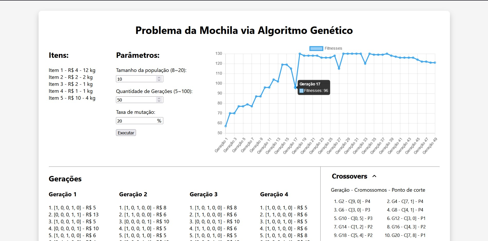

# 🎒 Knapsack Genetic Algorithm

Solution of the Knapsack problem using a Genetic Algorithm [Access Now](https://snapsack.vercel.app/)

<h1 align="center">
    
</h1>

## :rocket: Technologies

- [NextJs](https://nextjs.org)
- [TypeScript](https://www.typescriptlang.org/)

## Getting Started

Download the project dependencies.

```bash
npm install
# or
yarn
```

Then, run the development server:

```bash
npm run dev
# or
yarn dev
```

Open [http://localhost:3000](http://localhost:3000) with your browser to see the result.
